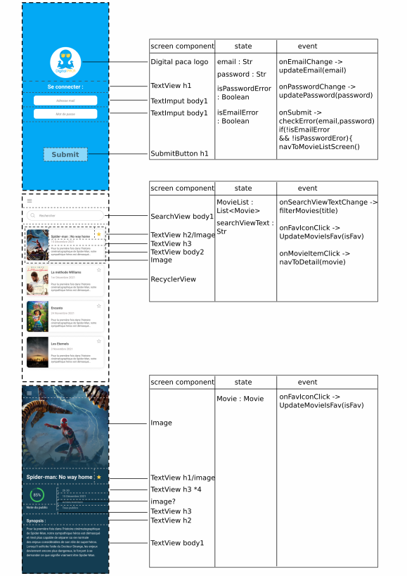
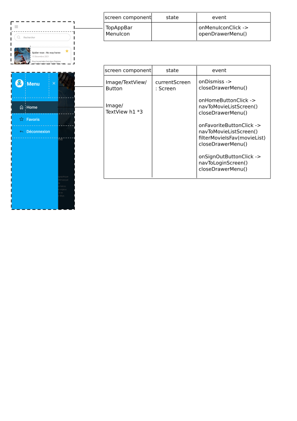

# Test technique App Front Digital PACA

### Consignes
Développer une app comprenant :

- Intégration de tous les écrans (voir dossier assets/screens/)
    - Écran login (voir 1-Connexion.png)
    - Menu drawer (voir 4-Menu.png)
    - Écran liste des séries (voir 2-Liste.png)
    - Écran de détails d'une série (voir 3-Détails.png)
- Connexion via l'API (voir 'Infos API')
    - Gestion tokens (utilisation du refreshToken)
- Liste des séries dynamique (via webservice)

### Optionnel (par ordre de priorité)
- Persitence de la connexion
- Déconnexion (locale, pas d'appel Webservice)
- Recherche liste (filtre liste sur titre)
- Gestion locale des favoris

## API infos
Voir collection postman "[Dp-Test-Tech] - API.postman_collection.json"

- Endpoint : 'http://138.68.104.234:8080/'
- Routes
    - /auth/login : authentification via user/pass permettant de récupérer un token (user: "test-tech-dp-api_front@gmail.com" / pass: "#j3apZAYBAm@Q4T2C!dQa")
    - /auth/refresh : récupération d'un nouveau token via refreshToken
    - /series : liste de séries (sécurisé via token)

-------------------------------------------------------------------------------------------------

# WORK DONE

## Analyse and cut requiered Ui

